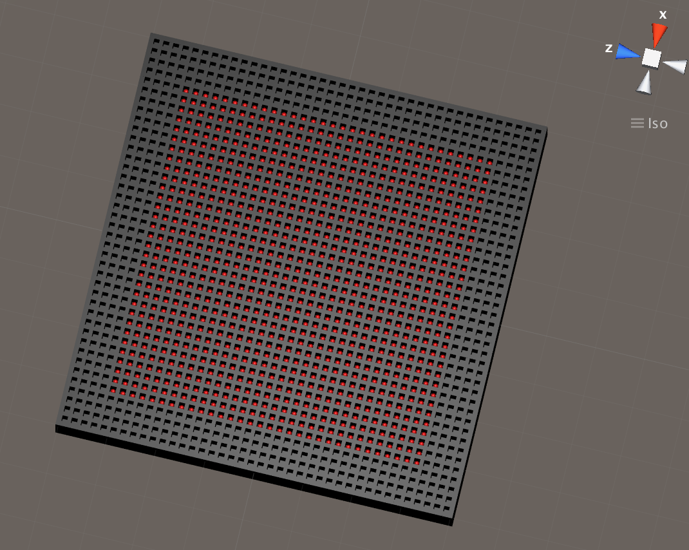

# Unity ML-Agents Multi-Agent Time Ratio (between model & environment) Benchmark

This benchmarks the ratio of time spent running a given multi-agent Unity environment vs time spent running the forward and/or backwards_update passes of all the rl agent models that act in a given multi-agent Unity environment.
This repo provides project files for building/editing multiple different multi-agent Unity environment, and it also provides code for benchmarking the ratio of time spent. 

## Usage

Current Unity environments were compiled/built to run on Mac only.
All the compiled environments are in folder `./python`.
Files for modifying the environments are in the folder `./unity-environment/Assets/ML-Agents/Examples/Comm`; reopening files in this folder via Unity Editor and building them for Linux or Windows will be necessary if you want to run them on Linux or Windows.

to get runtime stats for a specific num_of_agents, run while in folder `./python`:
```
python3 learn.py agents*_brains1
```
for example, for num_of_agents=64, run:
```
python3 learn.py agents64_brains1
```

When runtime stats are done being obtained, terminal will output text that looks like:
```
agents1_brains1
model_fwd_step_time_avg  0.0007924704892294747
env_step_time_avg  0.0006910109519958496
model_fwd_step_time_avg / env_step_time_avg =  1.1468276833248143
```
and then output an intended error:
```
NameError: name 'end' is not defined
```

All the current results are in folder `./multi-agent_time_balance_results_laptop`, with an additional README.md in that folder explaining the results

# Picture of a 1024 agent Unity Environment this repo provides


# Versions used
tensorflow_version=='1.6.0-rc1' cpu float32

unity_version==Unity_2017.3.1f1_Personal_64_bit
